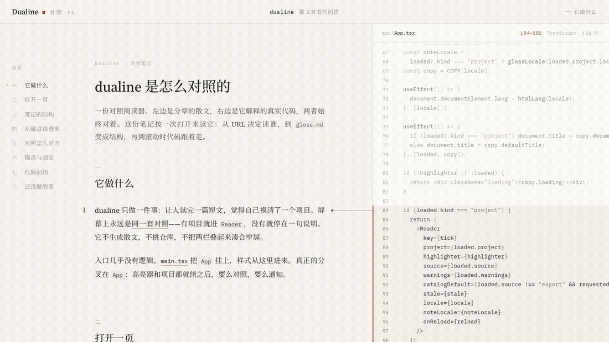

# Dualine

左边一篇散文，右边它解释的真代码。滚着读，两者不走丢。

A facing-page reader: the essay on the left, the real code it faces on the right.

**[打开对照](https://qzyh123.github.io/Dualine/)** — Dualine 读自己，不用安装。



## 试一下

```sh
git clone https://github.com/QZYH123/Dualine.git
cd Dualine
npm install && npm run dev:all
```

打开 <http://localhost:5173>。需要 Node 20.19+ 或 22.12+。

读 Dualine 自己：`GLOSS_PROJECTS_DIR=$PWD npm run dev:all`，然后 <http://localhost:5173/?project=dualine>。

Dualine 只负责读。对照笔记是 `gloss.md`，手写或让 agent 用仓库里的 `write-gloss` 技能起草。

## 读自己的项目

没有选择器。环境变量指到项目文件夹（里面有 `gloss.md`），或指到「每个子文件夹一个项目」的目录：

```
~/glosses/                ← GLOSS_PROJECTS_DIR
  my-app/                 ← 项目 id：小写字母、数字、- 或 _
    gloss.md
    src/…
```

```sh
GLOSS_PROJECTS_DIR=~/glosses/my-app npm run dev:all
```

打开 `http://localhost:5173/?project=my-app`。没有 `?project=` 时打开目录里的第一项。章节在 URL 里是 `#c3`。

改 `gloss.md` 时桅头会出现 **已更新**，点了才重载，不抢阅读位置。

## 写出对照笔记

Markdown 加一种锚点：`[这句话](src/server.ts#L18-L59)` 对着真实行号。范本是 `examples/shortly/gloss.md`。

把 `.cursor/skills/write-gloss/SKILL.md` 拷进 agent 的技能里，让它写 `gloss.md`，再指向那个项目打开 Dualine。

```md
---
name: shortly
tagline: 一个短链接服务
lang: typescript
---

# shortly 是怎么工作的

## 它做什么

整个服务是[三个 HTTP 接口](src/server.ts#L18-L59)……
```

`#` 是标题，`##` 是章。`[这句话](src/server.ts#L18-L59)` 对着真实行号。没有锚点的段落继承上一段的代码。范本：`examples/shortly/gloss.md`。

```sh
npm run check:gloss -- ~/glosses          # 锚点是否落在文件里，正文是否还对得上 gloss.lock
npm run check:gloss -- ~/glosses --accept # 范围改对之后，重写锁
```

`gloss.lock` 记住每条锚点对着的**代码正文**。行号整体挪了、字没变，仍然通过；行号还合法、字变了，检查失败。和 `gloss.md` 一起提交。

## 带走一张对照页

```sh
npm run export:gloss -- ~/glosses/my-app   # → export/my-app/
```

打开其中的 `index.html`，不用跑 API。上面的在线演示就是这样冻出来的。

## 运行说明

`npm run dev:all` 会同时起网页（:5173）和 API（127.0.0.1:8787）。一次 `Ctrl-C` 两边都停。端口被占用时换一个：`PORT=8790 npm run dev:all`。只跑 `npm run dev` 时，API 不在就回落到打包的 shortly 示例。

| 环境变量 | 默认 | |
|---|---|---|
| `GLOSS_PROJECTS_DIR` | 本仓库 `examples/` | 项目目录；会展开 `~/`、`$HOME/` |
| `PORT` | `8787` | API 端口 |
| `HOST` | `127.0.0.1` | API 只绑本机。要对外必须显式 `HOST=0.0.0.0` |
| `GLOSS_API` | `http://127.0.0.1:$PORT` | 网页代理 API 的地址 |

对照需要大约 1100px 宽的窗口；更窄会直接说明，而不是把两栏叠起来。

`npm run check` 会做类型检查、校验 `examples/` 和本仓库自己的 `gloss.md`、再跑测试。

## 还没做的事

- Dualine 不从代码生成散文。
- 没有项目选择器，没有远程 clone。换项目改 URL。
- 窄屏不是目标。

MIT。这是本地应用，不是 npm 库（`private: true`）。
